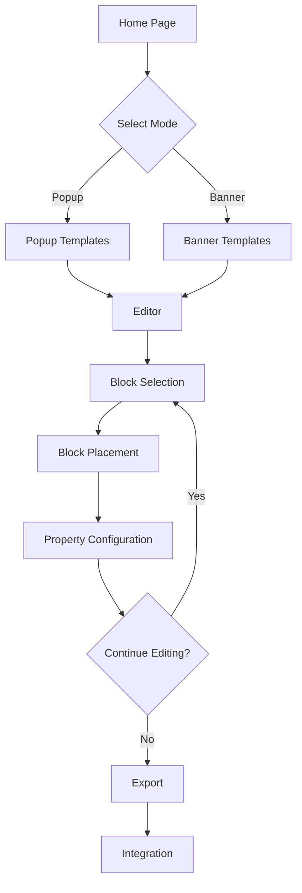

# 🚀 Drag & Drop Popup/Banner Builder

## 📋 Project Overview

A modern React-based drag-and-drop editor for creating popups and banners. This system will replace the existing PHP/JS implementation with a more flexible and user-friendly interface.

### Core Features
- Template gallery with categorized designs
- Drag & drop interface for easy editing
- Comprehensive block system (text, images, forms, timers, etc.)
- Property panel for customizing blocks
- Export options (JSX, HTML, JSON)
- Integration path with existing PHP system

## 🏗️ Architecture

### 1. Application Flow



### 2. Component Structure

```
App/
├── HomePage/
│   ├── ModeSelection/
│   │   ├── PopupOption/
│   │   └── BannerOption/
│   └── Header/
├── TemplateGallery/
│   ├── TemplateCard/
│   ├── CategoryFilter/
│   └── SearchBar/
├── Editor/
│   ├── Canvas/
│   │   ├── DropZone/
│   │   └── BlockRenderer/
│   ├── Sidebar/
│   │   ├── BlockCategories/
│   │   └── BlockList/
│   └── PropertyPanel/
│       ├── BlockProperties/
│       └── CanvasProperties/
└── Export/
    ├── JSXExport/
    ├── HTMLExport/
    └── JSONExport/
```

### 3. State Management

Using Zustand for global state management:

```typescript
interface BuilderStore {
  // Canvas state
  canvasMode: 'popup' | 'banner';
  canvasSize: { width: number; height: number };
  canvasBackground: string;
  
  // Blocks state
  blocks: BlockInstance[];
  selectedBlockId: string | null;
  
  // Actions
  addBlock: (block: BlockInstance) => void;
  updateBlock: (id: string, data: Partial<BlockInstance>) => void;
  removeBlock: (id: string) => void;
  selectBlock: (id: string | null) => void;
  
  // History
  history: HistoryState[];
  currentHistoryIndex: number;
  undo: () => void;
  redo: () => void;
  
  // Export
  exportToJSX: () => string;
  exportToHTML: () => string;
  exportToJSON: () => object;
}
```

## 🧩 Block System

### Block Interface

```typescript
interface BlockInstance {
  id: string;                    // Unique identifier
  type: BlockType;               // Type of block
  content: any;                  // Block-specific content
  style: BlockStyle;             // Visual styling
  position: { x: number; y: number }; // Position on canvas
  size: { width: number; height: number }; // Block dimensions
  zIndex: number;                // Stacking order
  animation?: BlockAnimation;    // Optional animations
  actions?: BlockAction[];       // Interactive actions
}

type BlockType = 
  // Basic elements
  | 'text' 
  | 'image' 
  | 'button'
  | 'divider'
  | 'columns'
  | 'html'
  
  // Form elements
  | 'form'
  | 'input-text'
  | 'input-email'
  | 'input-phone'
  | 'input-date'
  | 'checkbox'
  | 'radio'
  | 'dropdown'
  | 'textarea'
  
  // Special elements
  | 'countdown-timer'
  | 'progress-bar'
  | 'social-icons'
  | 'video'
  
  // Prize elements
  | 'spin-wheel'
  | 'scratch-card'
  | 'coupon-code'
  | 'gift-box';
```

### Block Categories

1. **Basic Elements**
   - Text: Headings, paragraphs, lists
   - Image: Upload, URL, gallery
   - Button: CTA, links, actions
   - Divider: Horizontal lines, spacers
   - Columns: Multi-column layouts
   - HTML: Custom code insertion

2. **Form Elements**
   - Form Container: Wraps form elements
   - Input Fields: Text, email, phone, etc.
   - Selection Controls: Checkboxes, radio buttons
   - Dropdown: Select options
   - Address: Location input
   - Date Picker: Calendar selection

3. **Special Elements**
   - Countdown Timer: Deadline timers
   - Progress Bar: Visual indicators
   - Social Icons: Platform links
   - Video Player: Embedded videos

4. **Prize Elements**
   - Spin Wheel: Interactive prize wheel
   - Scratch Card: Virtual scratch-off
   - Coupon Code: Discount generators
   - Gift Box: Surprise reveals

## 🎨 Canvas System

### Popup Mode

- **Default Size**: 450px × 600px
- **Features**:
  - Close button (customizable)
  - Overlay background (color, opacity)
  - Responsive scaling options
  - Animation effects (entrance/exit)
  - Trigger settings (timing, scroll, exit intent)

### Banner Mode

- **Default Size**: 1024px × 80px
- **Features**:
  - Position options (top, bottom, side)
  - Sticky behavior
  - Compact layout
  - Dismissible options
  - Animation effects

## 🔄 Drag & Drop Implementation

Using `react-dnd` for drag and drop functionality:

### DragSource Components
- Block palette items (left sidebar)
- Existing blocks on canvas (for repositioning)
- Resize handles

### DropTarget Components
- Canvas area
- Block containers (for nesting)
- Specific drop zones

### Drag & Drop Flow
1. User selects block from sidebar
2. Drags to canvas area
3. On drop, block instance is created
4. Block is rendered at drop position
5. Block is automatically selected
6. Properties panel updates with block options

## ⚙️ Properties Panel

### Canvas Properties
- Dimensions (width, height)
- Background (color, image, gradient)
- Padding & margins
- Border & shadow
- Animation settings
- Display triggers

### Block Properties
- Common properties:
  - Position & size
  - Background
  - Border & shadow
  - Spacing (margin, padding)
  - Animation
  
- Type-specific properties:
  - Text: font, size, color, alignment
  - Image: source, alt text, dimensions
  - Button: label, link, style
  - Timer: duration, format, expiry action
  - Form: fields, validation, submission

## 📤 Export System

### JSX Export
- React component generation
- Props for customization
- Styling with CSS-in-JS or CSS modules

### HTML Export
- Clean HTML structure
- Inline CSS for styling
- Minimal JavaScript for interactivity
- Self-contained file

### JSON Export
- Serialized representation of canvas state
- Block definitions and properties
- Can be reimported for editing
- Integration with PHP backend

## 🔄 PHP Integration Path

### Export Strategy
1. Generate clean HTML/CSS/JS
2. Create integration endpoints in PHP backend
3. Pass generated code through API
4. Store in database for retrieval
5. Provide embed code for websites

### Integration Points
- Template storage and retrieval
- User authentication
- Asset management
- Analytics integration
- A/B testing capabilities

## 📦 Dependencies

### Core Dependencies
- `react` ^19.1.0 - UI library
- `react-dom` ^19.1.0 - DOM rendering
- `zustand` - State management
- `react-dnd` - Drag and drop functionality
- `react-router-dom` - Routing
- `uuid` - Unique ID generation
- `lucide-react` - Icon library

### UI Dependencies
- `tailwindcss` - Utility-first CSS
- `@headlessui/react` - Accessible UI components
- `framer-motion` - Animations

### Utility Dependencies
- `html-to-react` - HTML parsing
- `react-color` - Color picker
- `react-resizable` - Resize functionality
- `html2canvas` - Canvas export

## 🗓️ Development Phases

### Phase 1: Foundation (Week 1-2)
- [x] Project setup
- [ ] Basic routing
- [ ] Home page with mode selection
- [ ] Template gallery structure
- [ ] Basic editor layout

### Phase 2: Core Editor (Week 3-4)
- [ ] Canvas implementation
- [ ] Basic drag & drop
- [ ] Block rendering system
- [ ] Property panel framework
- [ ] Basic block types (text, image, button)

### Phase 3: Block System (Week 5-6)
- [ ] Complete block library
- [ ] Form elements
- [ ] Special elements
- [ ] Prize elements
- [ ] Block styling options

### Phase 4: Advanced Features (Week 7-8)
- [ ] History (undo/redo)
- [ ] Export system
- [ ] Animations
- [ ] Responsive testing
- [ ] PHP integration planning

### Phase 5: Polish & Integration (Week 9-10)
- [ ] UI refinement
- [ ] Performance optimization
- [ ] Documentation
- [ ] PHP integration implementation
- [ ] Testing and bug fixes

## 🧪 Testing Strategy

### Unit Testing
- Component rendering
- State management
- Utility functions

### Integration Testing
- Drag & drop functionality
- Block interactions
- Export system

### User Testing
- Usability testing with designers
- Performance testing
- Cross-browser compatibility

## 📱 Responsive Design

### Approach
- Mobile-first design for editor UI
- Preview modes for different device sizes
- Responsive controls for canvas elements
- Adaptive property panel

### Breakpoints
- Mobile: < 768px
- Tablet: 768px - 1024px
- Desktop: > 1024px

## 🔒 Future Considerations

- User accounts and saved templates
- Team collaboration features
- Advanced analytics integration
- A/B testing capabilities
- Template marketplace 